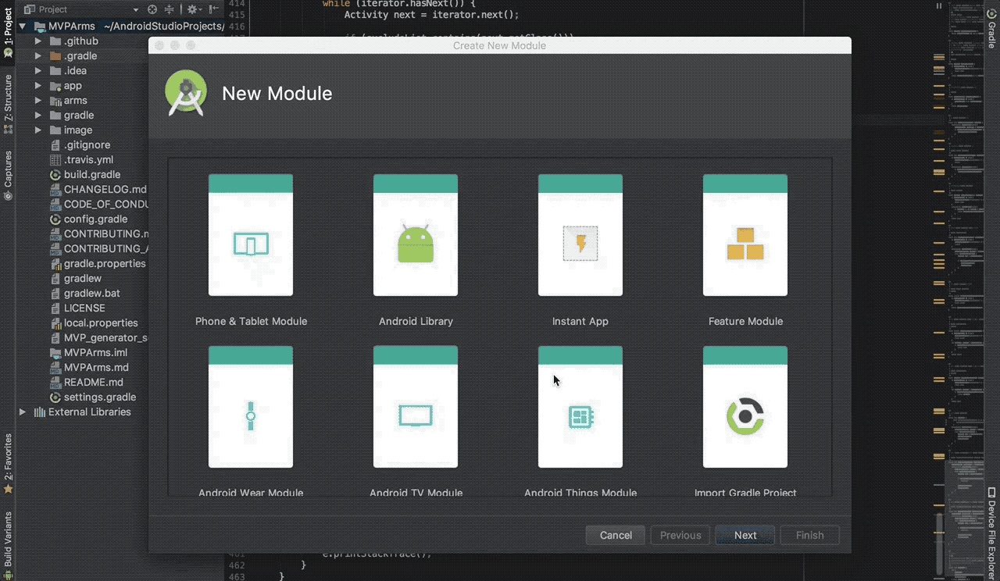

# MVPArms-Module-Template
**一键搭建 [MVPArms](https://github.com/JessYanCoding/MVPArms) 的官方架构, 让新手一秒即可开启 MVPArms 的世界, 免于项目繁琐配置的烦恼**

> **Tips: 先使用 MVPArms-Module-Template (Module 级一键模板) 一键搭建 MVPArms 的整体架构, 再使用 [MVPArmsTemplate](https://github.com/JessYanCoding/MVPArmsTemplate) (页面级一键模板) 一键生成每个业务页面所需要的 MVP 及 Dagger2 相关类, 即可让什么都不懂的新手也可以一秒开启 MVPArms 的世界!**  
> **若您基于本模板修改并且开源于网络, 请注明出处, 尊重开源, 才有人愿意开源, 谢谢!**

## Overview
