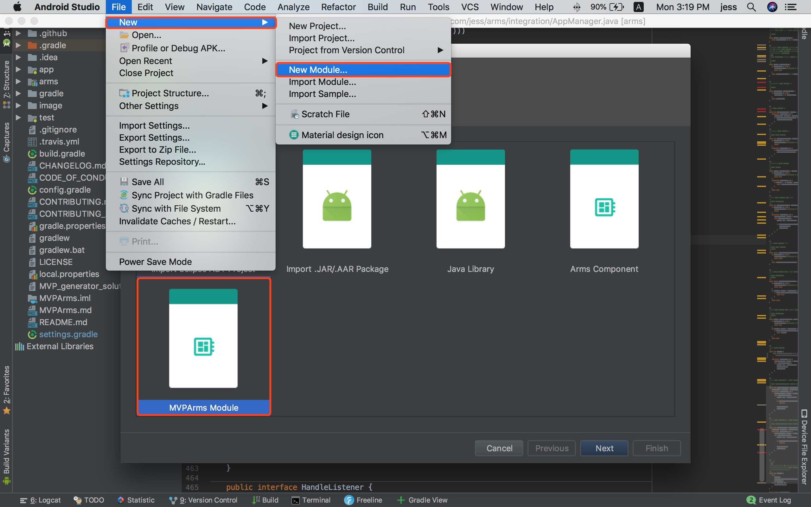
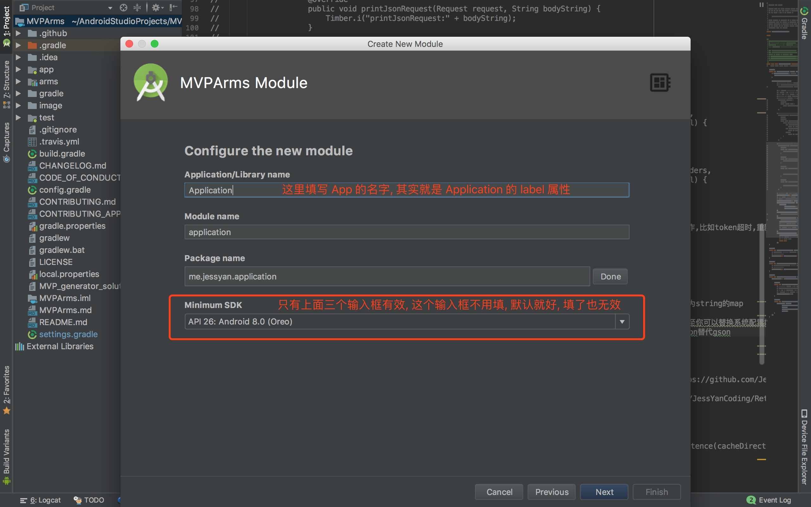

**一键搭建 [MVPArms](https://github.com/JessYanCoding/MVPArms) 的官方架构, 让新手一秒即可开启 MVPArms 的世界, 免于项目繁琐配置的烦恼**

> **Tips: 先使用 MVPArms-Module-Template (Module 级一键模板) 一键搭建 MVPArms 的整体架构, 再使用 [MVPArmsTemplate](https://github.com/JessYanCoding/MVPArmsTemplate) (页面级一键模板) 一键生成每个业务页面所需要的 MVP 及 Dagger2 相关类, 即可让什么都不懂的新手也可以一秒开启 MVPArms 的世界!**  
> **若您基于本模板修改并且开源于网络, 请注明出处, 尊重开源, 才有人愿意开源, 谢谢!**

此模板会持续保持更新新的内容并同步兼容最新的 **AndroidStudio 稳定版**, 如果最新的模板代码不能兼容您的 **AndroidStudio 旧版本**, 请自行升级  **AndroidStudio** 到最新的稳定版, 或者自行回滚模板代码到能兼容旧版本的代码 (因为模板也是和 **AndroidStudio** 的版本同步更新的, 但也可能模板第一次提交兼容的版本都高于您的 **AndroidStudio** 旧版本), 此模板由于会随时更新新的内容, 所以不可能为每个 **AndroidStudio** 版本都维护一个分支, 这将极大的增加我的工作量, 所以在受益于模板带来的便利的同时, 也请尊重我的决定, 请不要提关于 **AndroidStudio 旧版本** 不兼容的 **Issues**, 谢谢

## Overview

## 如何安装？
请将 **NewArmsModule** 这个文件夹复制到 **AndroidStudio Module** 模版的存放路径, 请注意是复制整个文件夹, 不是里面的内容!

**AndroidStudio Module** 模版存放路径 (**请注意 Module 级模板和页面级模板的存放路径不一样, 不要放错了!**):

* Windows : AS安装目录/plugins/android/lib/templates/gradle-projects

* Mac : /Applications/Android Studio.app/Contents/plugins/android/lib/templates/gradle-projects

**最后记得重启 AndroidStudio !**

## 如何使用?
使用时按下图步骤即可, 也可以使用快捷键, **Mac** 的快捷键是在项目名上按 **Command + n**, 选择  **Module**, **Windows** 快捷键自己百度

## 注意事项
* 建议直接在新建的新工程中使用本模板, 开始业务的开发, 让您免于项目繁琐的配置, 快速开启 MVPArms 的世界

* 本模板生成的是一个可以独立运行的 **Application Module**, 模板生成后一个完全属于您及您公司的 **MVP + Dagger2 + Retrofit + Rxjava** 项目就这样轻而易举的诞生了

